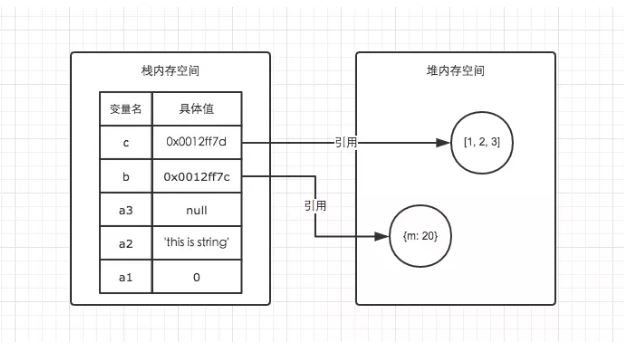
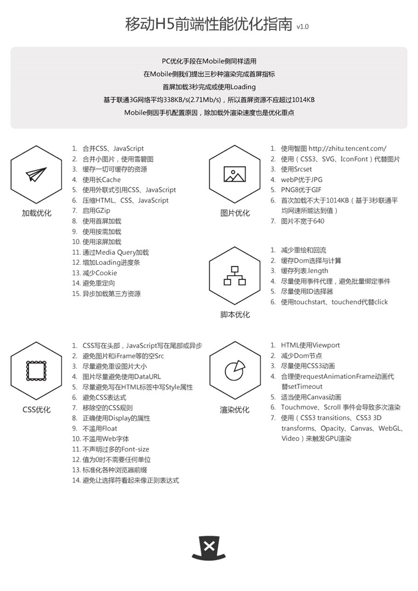
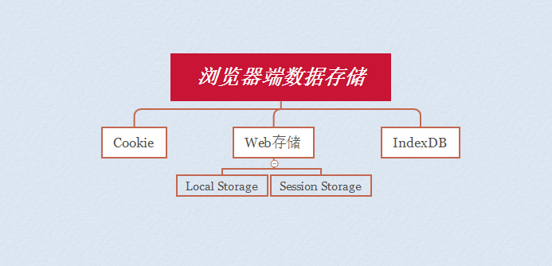

## JavaScript篇

- [JavaScript基础](#javascript基础)
    - [介绍JS的基本数据类型](#介绍js的基本数据类型)
    - [介绍JS有哪些内置对象](#介绍js有哪些内置对象)
    - [宿主对象和原生对象的区别](#宿主对象和原生对象的区别)
    - [null、undefined及未声明变量之间的区别。如何区分？](#nullundefined及未声明变量之间的区别如何区分)
    - [\==和===的区别](#\和的区别)
    - [JS隐式转换及应用场景](#js隐式转换及应用场景)
    - ["Attribute"和"Property"的区别](#attribute和property的区别)
    - [NaN是什么？如何判断是否是NaN类型](#nan是什么如何判断是否是nan类型)
    - [如何判断两个对象相等](#如何判断两个对象相等)
    - [什么是'user strict'，使用它有什么优缺点？](#什么是user-strict使用它有什么优缺点)
    - [call,apply和bind的作用是什么？两者区别是什么？](#callapply和bind的作用是什么两者区别是什么)
    - [请说明Function.prototype.bind的用法](#请说明functionprototypebind的用法)
    - [如何判断是否为空数组](#如何判断是否为空数组)
    - [数组方法](#数组方法)
    - [push、pop、shift、unshift功能及返回值](#pushpopshiftunshift功能及返回值)
    - [.forEach和.map()循环的主要区别，使用场景举例](#foreach和map循环的主要区别使用场景举例)
    - [JS执行对象查找时，永远不会去查找原型的函数是哪个？](#js执行对象查找时永远不会去查找原型的函数是哪个)
    - [如何将arguments转为数组](#如何将arguments转为数组)
    - [对象的遍历方法](#对象的遍历方法)
    - [数组的遍历方法](#数组的遍历方法)
    - [匿名函数的典型应用场景](#匿名函数的典型应用场景)
    - [IIFE(立即执行函数)的用法](#iife立即执行函数的用法)
    - [document的load事件和DOMContentLoaded事件之间的区别](#document的load事件和domcontentloaded事件之间的区别)
    - [数据类型判断方式有几种](#数据类型判断方式有几种)
    - [DOM操作(增删改查)](#dom操作增删改查)
    - [异步加载JS 的方式有哪些](#异步加载js-的方式有哪些)
    - [document.write和innerHTML有何区别](#documentwrite和innerhtml有何区别)
    - [jQuery.extend和jQuery.fn.extend的区别](#jqueryextend和jqueryfnextend的区别)
    - [针对jQuery性能的优化方法](#针对jquery性能的优化方法)
    - [如何判断当前脚本运行在浏览器还是node环境中](#如何判断当前脚本运行在浏览器还是node环境中)
    - [Canvas和SVG的比较](#canvas和svg的比较)
    - [Ajax的原理](#ajax的原理)
    - [JS事件委托、事件冒泡。](#js事件委托事件冒泡)
    - [IE和Firefox的事件机制有何区别，如何阻止冒泡？](#ie和firefox的事件机制有何区别如何阻止冒泡)
    - [JS内存空间的管理](#js内存空间的管理)
    - [JS执行上下文](#js执行上下文)
    - [JS变量对象详解](#js变量对象详解)
    - [请解释变量提升](#请解释变量提升)
    - [JS作用域及作用域链/闭包（closure），常用场景举例说明](#js作用域及作用域链闭包closure常用场景举例说明)
    - [请简述JS中的this](#请简述js中的this)
    - [JS函数与函数式编程](#js函数与函数式编程)
    - [JS原型，原型链。实现继承的方式](#js原型原型链实现继承的方式)
    - [JS有哪几种创建对象的方式](#js有哪几种创建对象的方式)
    - [请解释事件循环，调用堆栈和任务队列的区别](#请解释事件循环调用堆栈和任务队列的区别)
    - [谈谈对Promise的理解](#谈谈对promise的理解)
    - [ES6知识点](#es6知识点)
    - [防抖与节流](#防抖与节流)
    - [模块化](#模块化)
    - [oAuth实现方案](#oauth实现方案)
    - [如何实现单点登录(Single Sign On)](#如何实现单点登录single-sign-on)
    - [请解释SPA(单页应用)，优缺点是什么？如何使其对SEO友好](#请解释spa单页应用优缺点是什么如何使其对seo友好)
    - [前端性能优化方案](#前端性能优化方案)
    - [正则表达式](#正则表达式)
    - [设计模式举例(实现、应用、优缺点)](#设计模式举例实现应用优缺点)
    - [前端常用框架对比](#前端常用框架对比)
    - [JS编码规范](#js编码规范)
- [浏览器相关](#浏览器相关)
    - [浏览器架构](#浏览器架构)
    - [浏览器下事件循环(Event Loop)](#浏览器下事件循环event-loop)
    - [浏览器解析流程](#浏览器解析流程)
    - [从输入 url 到展示的过程](#从输入-url-到展示的过程)
    - [功能检测、功能推断、navigator.userAgent的区别](#功能检测功能推断navigatoruseragent的区别)
    - [浏览器版本检测方式](#浏览器版本检测方式)
    - [JS同源策略(same-origin policy)](#js同源策略same-origin-policy)
    - [跨标签页通讯](#跨标签页通讯)
    - [跨域的解决方案](#跨域的解决方案)
    - [浏览器数据本地存储方法（localStroage、sessionStroage、cookie、indexedDB）](#浏览器数据本地存储方法localstroagesessionstroagecookieindexeddb)
    - [Web安全举例](#web安全举例)
    - [状态码](#状态码)
    - [Web Worker](#web-worker)
    - [内存泄露](#内存泄露)
    - [HTTP缓存机制](#http缓存机制)
    - [cookie和session的区别](#cookie和session的区别)
    - [常见兼容性问题(移动端/PC端)](#常见兼容性问题移动端pc端)
    - [polyfill的作用](#polyfill的作用)
- [代码相关](#代码相关)
    - [44个 Javascript 题解析](#44个-javascript-题解析)
    - [43个 javascript 进阶问题列表](#43个-javascript-进阶问题列表)
    - [如何实现数组去重](#如何实现数组去重)
    - [正则实现trim()功能](#正则实现trim功能)

## JavaScript基础

### 介绍JS的基本数据类型
string number boolean undefined null

### 介绍JS有哪些内置对象
- **数据封装类对象**: String Number Boolean Array Object
- **其他对象**: Function Math Date Error Arguments RegExp

### 宿主对象和原生对象的区别
 - 原生对象(native object)是由ECMAScript规范定义的JavaScript内置对象，如 String Number Boolean Array Object Function Math Date Error Arguments RegExp等。
 - 宿主对象(host object)是由运行时的环境(浏览器或node)决定的，如window、XMLHTTPRequest等。

### null、undefined及未声明变量之间的区别。如何区分？
- 未声明变量默认值为undefined
- `typeof null === 'object'    // true`
- `typeof undefined === 'undefined'    // true`

### \==和===的区别
- ==比较之前会先进行类型转换，即不会对类型进行比较。例如：

        12 == '12'  // true
        true == 1   // true
        false == '0' // true
- ===会比较数值和类型。例如：

        12 === '12' // false
	    12 === 12 // true
	    true === 1 // false
	    false === '0' // false

### JS隐式转换及应用场景
JS在使用运算符号或者对比符时，会自带隐式转换，规则如下:

- -、*、/、% ：一律转换成数值后计算
- +：

    - 数字 + 字符串 = 字符串， 运算顺序是从左到右
    - 数字 + 对象， 优先调用对象的valueOf -> toString
    - 数字 + boolean/null -> 数字
    - 数字 + undefined -> NaN

- [1].toString() === '1'
- {}.toString() === '[object object]'
- NaN !== NaN 、+undefined 为 NaN

参考: 
- https://juejin.im/post/5a7172d9f265da3e3245cbca

### "Attribute"和"Property"的区别
"Attribute"是在HTML中定义的，而"property"是在DOM上定义的。为了说明区别，假设我们在HTML中有一个文本框：  
    `<input type="text" value="Hello">`

    const input = document.querySelector('input');
    console.log(input.getAttribute('value')); // Hello
    console.log(input.value); // Hello

但是在文本框中键入“ World!”后:

    console.log(input.getAttribute('value')); // Hello
    console.log(input.value); // Hello World!

### NaN是什么？如何判断是否是NaN类型
- **定义**: 全局属性 NaN 的值表示不是一个数字（Not-A-Number）
- **如何判断一个值是否是NaN**: 等号运算符（== 和 ===） 不能被用来判断一个值是否是 NaN。必须使用 Number.isNaN() 或 isNaN() 函数。  

	    NaN === NaN;        // false
	    Number.NaN === NaN; // false
	    isNaN(NaN);         // true
	    isNaN(Number.NaN);  // true

### 如何判断两个对象相等
需要考虑三个问题：
1. 如果对象的属性值之一本身就是一个对象
2. 如果属性值中的一个是NaN（在JavaScript中，是不是等于自己唯一的价值？）
3. 如果一个属性的值为undefined，而另一个对象没有这个属性（因而计算结果为不确定？）  

检查对象的“值相等”的一个强大的方法，最好是依靠完善的测试库，涵盖了各种边界情况。Underscore和Lo-Dash有一个名为_.isEqual()方法，用来比较好的处理深度对象的比较。您可以使用它们像这样：  

    // Outputs: true
    console.log(_.isEqual(obj1, obj2));

### 什么是'user strict'，使用它有什么优缺点？
'use strict' 是用于对整个脚本或单个函数启用严格模式的语句。严格模式是可选择的一个限制 JavaScript 的变体一种方式 。  
**优点：**
 - 无法再意外创建全局变量。
 - 会使引起静默失败（silently fail，即：不报错也没有任何效果）的赋值操抛出异常。
 - 试图删除不可删除的属性时会抛出异常（之前这种操作不会产生任何效果）。
 - 要求函数的参数名唯一。
 - 全局作用域下，this的值为undefined。
 - 捕获了一些常见的编码错误，并抛出异常。
 - 禁用令人困惑或欠佳的功能。

**缺点：**
 - 缺失许多开发人员已经习惯的功能。
 - 无法访问function.caller和function.arguments。
 - 以不同严格模式编写的脚本合并后可能导致问题。

总的来说，我认为利大于弊，我从来不使用严格模式禁用的功能，因此我推荐使用严格模式。

### call,apply和bind的作用是什么？两者区别是什么？
.call和.apply都用于调用函数，第一个参数将用作函数内 this 的值。然而，.call接受逗号分隔的参数作为后面的参数，而.apply接受一个参数数组作为后面的参数。一个简单的记忆方法是，从call中的 C 联想到逗号分隔（comma-separated），从apply中的 A 联想到数组（array）。

    function add(a, b) {
    return a + b;
    }

    console.log(add.call(null, 1, 2)); // 3
    console.log(add.apply(null, [1, 2])); // 3

.call和.apply是立即执行的, .bind 返回函数的副本，但带有绑定上下文！它不是立即执行的。

    const person = { name: 'Lydia' }

    function sayHi(age) {
    console.log(`${this.name} is ${age}`)
    }

    sayHi.call(person, 21)
    sayHi.bind(person, 21)

    结果: Lydia is 21 function

### 请说明Function.prototype.bind的用法
摘自MDN：

 > bind()方法创建一个新的函数, 当被调用时，将其 this 关键字设置为提供的值，在调用新函数时，在任何提供之前提供一个给定的参数序列。

根据我的经验，将this的值绑定到想要传递给其他函数的类的方法中是非常有用的。在 React 组件中经常这样做。

### 如何判断是否为空数组

    var arr = [];
    if (Array.isArray(arr) && arr.length === 0) {
        console.log('是空数组');
    }
    // Array.isArray是ES5提供的，如果不支持。用下面的方案。
    if (!Array.isArray) {
        Array.isArray = function(arg) {
            return Object.prototype.toString.call(arg) === '[object Array]';
        };
    }

### 数组方法
- map: 遍历数组，返回回调返回值组成的新数组
- forEach: **无法break**，可以用try/catch中throw new Error来停止
- filter: 过滤
- some: 有一项返回true，则整体为true
- every: 有一项返回false，则整体为false
- join: 通过指定连接符生成字符串
- sort(fn) / reverse: 排序与反转，改变原数组
- concat: 连接数组，不影响原数组， 浅拷贝
- slice(start, end): 返回截断后的新数组，不改变原数组
- splice(start, number, value...): 返回删除元素组成的数组，value 为插入项，改变原数组
- indexOf / lastIndexOf(value, fromIndex): 查找数组项，返回对应的下标
- reduce / reduceRight(fn(prev, cur), defaultPrev): 两两执行，prev 为上次化简函数的return值，cur 为当前值(从第二项开始)

**数组乱序：**

    var arr = [1, 2, 3, 4, 5, 6, 7, 8, 9, 10];
    arr.sort(function () {
        return Math.random() - 0.5;
    });

**数组拆解:**
    
    // flat: [1,[2,3]] --> [1, 2, 3]

    Array.prototype.flat = function() {
        return this.toString().split(',').map(item => +item )
    }

### push、pop、shift、unshift功能及返回值

- **push**：添加新元素到数组末尾，返回数组长度
- **pop**：移除数组最后一个元素，返回元素本身
- **unshift**：添加新元素到数组开头，返回数组长度
- **shift**：移除数组首个元素，返回元素本身

以上4种操作均会改变数组本身

### .forEach和.map()循环的主要区别，使用场景举例
map用法:

    let array = [1, 2, 3, 4, 5];
    let newArray = array.map((item, i, arr) => {
        return item * 2;
    });
    console.log("array:", array);       // [1, 2, 3, 4, 5]
    console.log("newArray:", newArray); // [2, 4, 6, 8, 10]
    // 此处的array接受map方法运算之后的返回值
    // 但是map方法并不能改变原来的数组

forEach用法:

    let array = [1, 2, 3, 4, 5];
    let newArray = array.forEach((item, i, arr) => {
        console.log('item:' + item + ', index:' + i);
        // array[i] = item * 2;    // 可以用这种方式改变原始数组的值
    });
    console.log("array:", array);       // [1, 2, 3, 4, 5]
    console.log("newArray:", newArray); // undefined
    // forEach方法没有返回值

- 能用forEach()做到的，map()同样可以。反过来也是如此。
- map()会分配内存空间存储新数组并返回，forEach()不会返回数据。
- forEach()允许callback更改原始数组的元素。map()返回新的数组。

### JS执行对象查找时，永远不会去查找原型的函数是哪个？

    Object​.prototype​.has​OwnProperty()

参考：
- https://developer.mozilla.org/en-US/docs/Web/JavaScript/Reference/Global_Objects/Object/hasOwnProperty

### 如何将arguments转为数组
1. Array.prototype.slice.call(arguments)
2. [].slice.call(arguments)

### 对象的遍历方法
- for循环

        for (let property in obj) {
            console.log(property);
        }
    
    但是，这还会遍历到它的继承属性，在使用之前，你需要加入obj.hasOwnProperty(property)检查。

- Object.keys()

        Object.keys(obj).forEach((property) => { ... })

    Object.keys()方法会返回一个由一个给定对象的自身可枚举属性组成的数组。

- Object.getOwnPropertyNames()

        Object.getOwnPropertyNames(obj).forEach((property) => { ... })

    Object.getOwnPropertyNames()方法返回一个由指定对象的所有自身属性的属性名（包括不可枚举属性但不包括 Symbol 值作为名称的属性）组成的数组。

### 数组的遍历方法
- for loops

        for (let i = 0; i < arr.length; i++) { ... }

- forEach

        arr.forEach((item, index, arr) { ... })

- map

        arr.map((item, index, arr) => { ... })

### 匿名函数的典型应用场景
匿名函数可以在 IIFE 中使用，来封装局部作用域内的代码，以便其声明的变量不会暴露到全局作用域。

    (function() {
        // 一些代码。
    })();
匿名函数可以作为只用一次，不需要在其他地方使用的回调函数。当处理函数在调用它们的程序内部被定义时，代码具有更好地自闭性和可读性，可以省去寻找该处理函数的函数体位置的麻烦。

    setTimeout(function() {
        console.log('Hello world!');
    }, 1000);
匿名函数可以用于函数式编程或 Lodash（类似于回调函数）。

    const arr = [1, 2, 3];
    const double = arr.map(function(el) {
        return el * 2;
    });
    console.log(double); // [2, 4, 6]

### IIFE(立即执行函数)的用法
IIFE（ 立即调用函数表达式）是一个在定义时就会立即执行的  JavaScript 函数。

    (function () {
        statements
    })();
这是一个被称为 自执行匿名函数 的设计模式，主要包含两部分。第一部分是包围在 圆括号运算符 () 里的一个匿名函数，这个匿名函数拥有独立的词法作用域。这不仅避免了外界访问此 IIFE 中的变量，而且又不会污染全局作用域。

第二部分再一次使用 () 创建了一个立即执行函数表达式，JavaScript 引擎到此将直接执行函数。

参考：
 - https://developer.mozilla.org/en-US/docs/Glossary/IIFE

### document的load事件和DOMContentLoaded事件之间的区别
当初始的 HTML 文档被完全加载和解析完成之后，DOMContentLoaded事件被触发，而无需等待样式表、图像和子框架的完成加载。

window的load事件仅在 DOM 和所有相关资源全部完成加载后才会触发。

### 数据类型判断方式有几种
下面将对如下数据进行判断它们的类型

    var bool = true
    var num = 1
    var str = 'abc'
    var und = undefined
    var nul = null
    var arr = [1, 2, 3]
    var obj = {a: 'aa', b: 'bb'}
    var fun = function() {console.log('I am a function')}

- typeof: 适合基本的数据类型和函数 

        console.log(typeof bool);   // boolean
        console.log(typeof num);    // number
        console.log(typeof str);    // string
        console.log(typeof und);    // undefined
        console.log(typeof nul);    // object
        console.log(typeof arr);    // object
        console.log(typeof obj);    // object
        console.log(typeof fun);    // function

    由结果可知typeof可以测试出number、string、boolean、undefined及function，而对于null及数组、对象，typeof均检测出为object，不能进一步判断它们的类型。

- instanceof: 判断对象类型，基于原型链去判断。  
obj instanceof Object: 左操作数是一个对象，右操作数是一个函数构造器或者函数对象，判断左边的操作数的原型链_proto_属性是否有右边这个函数对象的proptotype属性。

        console.log(bool instanceof Boolean);// false
        console.log(num instanceof Number); // false
        console.log(str instanceof String); // false
        console.log(und instanceof Object); // false
        console.log(arr instanceof Array);  // true
        console.log(nul instanceof Object); // false
        console.log(obj instanceof Object); // true
        console.log(fun instanceof Function);// true

        var bool2 = new Boolean()
        console.log(bool2 instanceof Boolean);// true

        var num2 = new Number()
        console.log(num2 instanceof Number);// true

        var str2 = new String()
        console.log(str2 instanceof String);//  true

        function Animation(){}
        var ani = new Animation()
        console.log(ani instanceof Animation);// true

        function Dog(){}
        Dog.prototype = new Animation()
        var dog = new Dog()
        console.log(dog instanceof Dog);    // true
        console.log(dog instanceof Animation);// true
        console.log(dog instanceof Object); // true
    从结果中看出instanceof不能区别undefined和null，而且对于基本类型如果不是用new声明的则也测试不出来，对于是使用new声明的类型，它还可以检测出多层继承关系。

- constructor: 返回对创建此对象的函数的引用

        console.log(bool.constructor === Boolean);  // true
        console.log(num.constructor === Number);    // true
        console.log(str.constructor === String);    // true
        console.log(arr.constructor === Array);     // true
        console.log(obj.constructor === Object);    // true
        console.log(fun.constructor === Function);  // true

        console.log(ani.constructor === Animation); // true
        console.log(dog.constructor === Dog);       // false
        console.log(dog.constructor ===  Animation);// true

    null 和 undefined 是无效的对象，因此是不会有 constructor 存在的，这两种类型的数据需要通过其他方式来判断。

    函数的 constructor 是不稳定的，这个主要体现在自定义对象上，当开发者重写 prototype 后，原有的 constructor 引用会丢失。所以dog.constructor === Animation 而不是 Dog

- Object.prototype.toString.call

        console.log(Object.prototype.toString.call(bool));  //[object Boolean]
        console.log(Object.prototype.toString.call(num));   //[object Number]
        console.log(Object.prototype.toString.call(str));   //[object String]
        console.log(Object.prototype.toString.call(und));   //[object Undefined]
        console.log(Object.prototype.toString.call(nul));   //[object Null]
        console.log(Object.prototype.toString.call(arr));   //[object Array]
        console.log(Object.prototype.toString.call(obj));   //[object Object]
        console.log(Object.prototype.toString.call(fun));   //[object Function]

        console.log(Object.prototype.toString.call(dog));   //[object Object]  

    > 原理(摘自高级程序设计3)：在任何值上调用 Object 原生的 toString() 方法，都会返回一个 [object NativeConstructorName] 格式的字符串。每个类在内部都有一个 [[Class]] 属性，这个属性中就指定了上述字符串中的构造函数名。
    但是它不能检测非原生构造函数的构造函数名。

- 使用jquery中的$.type

        console.log($.type(bool));  //boolean
        console.log($.type(num));   //number
        console.log($.type(str));   //string
        console.log($.type(und));   //undefined
        console.log($.type(nul));   //null
        console.log($.type(arr));   //array
        console.log($.type(obj));   //object
        console.log($.type(fun));   //function

        console.log($.type(dog));   //object

    $.type()内部原理就是用的Object.prototype.toString.call()

### DOM操作(增删改查)
- 添加操作  

        let element = document.createElement("div");   // 创建元素
        body.appendChild(element);  // 将一个节点添加到指定父节点的子节点列表末尾

- 删除操作

        var oldChild = node.removeChild(child); // 删除子元素
        ChildNode.remove() // 删除元素

- 修改操作

        Node.innerText // 修改元素文本内容
        Element.innerHTML // 设置或获取描述元素后代的HTML语句

- 查找操作

        Document.getElementById() // 返回对拥有指定 id 的第一个对象的引用
        Document.querySelector() // 返回文档中匹配指定的CSS选择器的第一元素
        Document.querySelectorAll() // 返回与指定的选择器组匹配的文档中的元素列表

参考：
- https://developer.mozilla.org/zh-CN/docs/Web/API/Document_Object_Model

### 异步加载JS 的方式有哪些
浏览器下载除JS外的资源时，会并行下载，以提高性能。但下载JS脚本时，会禁止并行下载（称为脚本阻塞Scripts Block Downloads）。浏览器遇到JS时，必须等JS下载，解析，执行完后，才能继续并行下载下一个资源。原因是JS可能会改变页面或改变JS间的依赖关系，例如A.js中用document.write改变页面，B.js依赖于A.js。因此要严格保证顺序，不能并行下载。

由于浏览器在遇到\<body>标签前是不会渲染页面的，为了避免白屏，通常的建议是将JS放到<body>标签底下，可以有最佳的用户体验。

按推荐度排序：
1. 动态创建\

    浏览器解析到HTML里的该行script标签，发现指定为async，会异步下载解析执行脚本。

    async 是HTML5里为script标签新增的属性，对于低版本浏览器会存在兼容性问题。

    它会在下载完成后立刻执行，而不是会等到DOM加载完成之后再执行，所以还是有可能会造成阻塞。

    这种方式只适用于引用外部js文件的\

    浏览器解析到HTML里的该行script标签，发现指定为defer，会暂缓下载解析执行脚本。而是等到页面加载完毕后，才加载脚本（更精确地说，是在DOM树构建完成后，在window.onload触发前，加载defer的脚本）。

    defer也是只适用于外部js文件，也不能在js中使用document.write方法。

    可以保证多个js文件的执行顺序就是它们在页面中出现的顺序。

### document.write和innerHTML有何区别
- document.write会重绘整个页面，如果不指定元素的话，它会覆盖掉整个页面内容。
- innerHTML只会重绘页面的一部分。

### jQuery.extend和jQuery.fn.extend的区别
- https://api.jquery.com/jQuery.fn.extend/
- https://api.jquery.com/jQuery.extend/

### 针对jQuery性能的优化方法
- http://www.ruanyifeng.com/blog/2011/08/jquery_best_practices.html

### 如何判断当前脚本运行在浏览器还是node环境中
通过判断Global对象是否为window，如果不为window，则当前脚本运行在node.js环境中。

    this === window ? 'browser' : 'node';

### Canvas和SVG的比较
- https://www.educba.com/svg-vs-canvas/

### Ajax的原理
 - http://www.cnblogs.com/lidgblogs/p/7403828.html
 - https://www.cnblogs.com/ygj0930/p/6126542.html
 - http://www.cnblogs.com/jackson0714/p/AJAX.html#_label8

### JS事件委托、事件冒泡。

- https://www.cnblogs.com/owenChen/archive/2013/02/18/2915521.html

### IE和Firefox的事件机制有何区别，如何阻止冒泡？
- IE只支持**事件冒泡**，火狐同时支持**事件捕获**和**事件冒泡**两种。
- 阻止事件冒泡的方式不同    
    IE: e.cancelBubble = true    
    W3C: e.stopPropagation()

### JS内存空间的管理
 - **基础数据类型与栈内存**  
    JS中的基础数据类型，这些值都有固定的大小，往往都保存在栈内存中，由系统自动分配存储空间。我们可以直接操作保存在栈内存空间的值，因此基础数据类型都是按值访问。

    数据在栈内存中的存储与使用方式类似于数据结构中的堆栈数据结构，遵循后进先出的原则。
    > 基础数据类型： Number String Null Undefined Boolean

 - **引用数据类型与堆内存**  
    与其他语言不同，JS的引用数据类型，比如数组Array、对象Object、函数Function，它们值的大小是不固定的。引用数据类型的值是保存在堆内存中的对象。JavaScript不允许直接访问堆内存中的位置，因此我们不能直接操作对象的堆内存空间。
    
    

    在操作对象时，实际上是在操作对象的引用而不是实际的对象。因此，引用类型的值都是按引用访问的。这里的引用，我们可以粗浅地理解为保存在栈内存中的一个地址，该地址与堆内存的实际值相关联。

总结:

| 栈内存 | 堆内存 |
| --- | --- |
| 存储基础数据类型 | 存储引用数据类型 |
| 按值访问 | 按引用访问 |
| 存储的值大小固定 | 存储的值大小不定，可动态调整 |
| 由系统自动分配内存空间 | 由开发人员通过代码分配 |
| 主要用来执行程序 | 主要用来存放对象 |
| 空间小，运行效率高 | 空间大，但是运行效率相对较低 |
| 先进后出，后进先出 | 无序存储，可根据引用直接获取 |

### JS执行上下文
- https://segmentfault.com/a/1190000012646203

### JS变量对象详解
- https://segmentfault.com/a/1190000012646211

### 请解释变量提升
- https://segmentfault.com/a/1190000003114255

### JS作用域及作用域链/闭包（closure），常用场景举例说明
- https://segmentfault.com/a/1190000012646221
- https://segmentfault.com/a/1190000012646261

### 请简述JS中的this
- https://segmentfault.com/a/1190000012646234

### JS函数与函数式编程
- https://segmentfault.com/a/1190000012646274

### JS原型，原型链。实现继承的方式
- https://segmentfault.com/a/1190000012646286

### JS有哪几种创建对象的方式
1. 利用Object构造函数方式创建
2. 利用对象字面量方式创建
3. 利用工厂模式创建
4. 利用构造函数模式创建
5. 利用原型方式创建
6. 利用构造函数和原型的组合模式创建

参考：
- https://juejin.im/post/5b150fcf518825139b18de11

### 请解释事件循环，调用堆栈和任务队列的区别

- https://segmentfault.com/a/1190000012646373
- https://zhuanlan.zhihu.com/p/25407758
- https://juejin.im/post/58cf180b0ce4630057d6727c
- https://blog.csdn.net/lin_credible/article/details/40143961

### 谈谈对Promise的理解
- https://segmentfault.com/a/1190000012646402

### ES6知识点
1. var let const
2. =>箭头函数
3. 模版字符串
3. 解析结构
4. 函数默认参数
5. ...展开运算符
6. class
7. Promise

参考：
- https://segmentfault.com/a/1190000012646425
- http://es6.ruanyifeng.com/

### 防抖与节流
防抖与节流函数是一种最常用的 高频触发优化方式，能对性能有较大的帮助。

- **防抖 (debounce)**: 将多次高频操作优化为只在最后一次执行，通常使用的场景是：用户输入，只需再输入完成后做一次输入校验即可。

- **节流(throttle):** 每隔一段时间后执行一次，也就是降低频率，将高频操作优化成低频操作，通常使用场景: 滚动条事件 或者 resize 事件，通常每隔 100~500 ms执行一次即可。

        function throttle(method, context) {
            clearTimeout(method.tID);
            method.tID = setTimeout(function () {
                method.call(context);
            }, 1000);
        }

    用法：

        function showTime() {
            console.log("nowDate:" + new Date().toLocaleDateString());
        }

        setInterval(function () {
            throttle(showTime);
        }, 2000);

### 模块化
模块化开发在现代开发中已是必不可少的一部分，它大大提高了项目的可维护、可拓展和可协作性。通常，我们 在浏览器中使用 ES6 的模块化支持，在 Node 中使用 commonjs 的模块化支持。

**分类:**

- es6: import / export
- commonjs: require / module.exports / exports
- amd: require / defined

**require与import的区别**
- require支持 动态导入，import不支持，正在提案 (babel 下可支持)
- require是 同步 导入，import属于 异步 导入
- require是 值拷贝，导出值变化不会影响导入值；import指向 内存地址，导入值会随导出值而变化

### oAuth实现方案
- http://www.ruanyifeng.com/blog/2019/04/oauth_design.html
- http://www.ruanyifeng.com/blog/2019/04/oauth-grant-types.html

### 如何实现单点登录(Single Sign On)
- https://www.cnblogs.com/ywlaker/p/6113927.html

### 请解释SPA(单页应用)，优缺点是什么？如何使其对SEO友好
单页Web应用（single page web application，SPA），就是只有一张Web页面的应用，是加载单个HTML 页面并在用户与应用程序交互时动态更新该页面的Web应用程序。  

|  |单页应用SPA|多页应用MPA|
|---|---|---|
|组成| 一个外壳页面和多个页面片段组成 | 多个完整页面构成 |
|资源共用(css,js)| 共用，只需在外壳部分加载 | 不共用，每个页面都需要加载 |
|刷新方式| 页面局部刷新或更改 | 整页刷新 |
|url 模式| a.com/#/pageone a.com/#/pagetwo | a.com/pageone.html  a.com/pagetwo.html |
|用户体验| 页面片段间的切换快，用户体验良好 由于要一次加载所有的资源(html/js)，故首屏加载慢 | 页面切换加载缓慢，流畅度不够，用户体验比较差 首屏加载很快 |
|转场动画| 容易实现 | 无法实现 |
|数据传递| 容易 | 依赖 url传参、或者cookie 、localStorage等 |
|搜索引擎优化(SEO)| 需要单独方案、实现较为困难、不利于SEO检索。 [Prerender预渲染优化SEO](http://codingfishman.github.io/2016/05/06/prerender%E9%A2%84%E6%B8%B2%E6%9F%93%E4%BC%98%E5%8C%96SEO/)| 实现方法简易|
|试用范围| 高要求的体验度、追求界面流畅的应用 | 适用于追求高度支持搜索引擎的应用|
|开发成本| 较高，常需借助专业的框架 | 较低，但页面重复代码多|
|维护成本| 相对容易 | 相对复杂|

参考：
- https://juejin.im/post/5a0ea4ec6fb9a0450407725c

### 前端性能优化方案
以下是移动端的优化方案，大部分Web端也同样适用

### 正则表达式
- https://juejin.im/post/5965943ff265da6c30653879

### 设计模式举例(实现、应用、优缺点)
- https://juejin.im/post/5c2e10a76fb9a049c0432697

### 前端常用框架对比
- https://cn.vuejs.org/v2/guide/comparison.html

### JS编码规范
- https://github.com/airbnb/javascript

## 浏览器相关

### 浏览器架构
- 用户界面
- 主进程
- 内核
    - 渲染引擎
    - JS 引擎
        - 执行栈
    - 事件触发线程
        - 消息队列
            - 微任务
            - 宏任务
    - 网络异步线程
    - 定时器线程

### 浏览器下事件循环(Event Loop)
事件循环是指: 执行一个宏任务，然后执行清空微任务列表，循环再执行宏任务，再清微任务列表

- 微任务 microtask(jobs): promise / ajax / Object.observe(该方法已废弃)
- 宏任务 macrotask(task): setTimout / setInterval / script / IO / UI Rendering

### 浏览器解析流程

 - https://segmentfault.com/a/1190000010298038

### 从输入 url 到展示的过程
- DNS 解析
- TCP 三次握手
- 发送请求，分析 url，设置请求报文(头，主体)
- 服务器返回请求的文件 (html)
- 浏览器渲染
    - HTML parser --> DOM Tree
        - 标记化算法，进行元素状态的标记
        - dom 树构建
    - CSS parser --> Style Tree
        - 解析 css 代码，生成样式树
    - attachment --> Render Tree
        - 结合 dom树 与 style树，生成渲染树
    - layout: 布局
    - GPU painting: 像素绘制页面

### 功能检测、功能推断、navigator.userAgent的区别
**功能检测（feature detection）**

功能检测包括确定浏览器是否支持某段代码，以及是否运行不同的代码（取决于它是否执行），以便浏览器始终能够正常运行代码功能，而不会在某些浏览器中出现崩溃和错误。例如：

    if ('geolocation' in navigator) {
    // 可以使用 navigator.geolocation
    } else {
    // 处理 navigator.geolocation 功能缺失
    }
Modernizr是处理功能检测的优秀工具。

**功能推断（feature inference）**

功能推断与功能检测一样，会对功能可用性进行检查，但是在判断通过后，还会使用其他功能，因为它假设其他功能也可用，例如：

    if (document.getElementsByTagName) {
    element = document.getElementById(id);
    }
非常不推荐这种方式。功能检测更能保证万无一失。

**UA 字符串**

这是一个浏览器报告的字符串，它允许网络协议对等方（network protocol peers）识别请求用户代理的应用类型、操作系统、应用供应商和应用版本。它可以通过navigator.userAgent访问。 然而，这个字符串很难解析并且很可能存在欺骗性。例如，Chrome 会同时作为 Chrome 和 Safari 进行报告。因此，要检测 Safari，除了检查 Safari 字符串，还要检查是否存在 Chrome 字符串。不要使用这种方式。  
考虑到历史原因及现代浏览器中用户代理字符串(userAgent)的使用方式，通过用户代理字符串来检测特定的浏览器并不是一件轻松的事情。所以使用用户代理检测是最后的选择。  
用户代理检测一般适用以下的情形：
- 不能直接准确的使用功能检测。
- 同一款浏览器在不同平台下具备不同的能力。这个时候可能就有必要确定浏览器位于哪个平台。
- 为了跟踪分析等目的需要知道特定的浏览器。

### 浏览器版本检测方式
可以使用navigator.userAgent。  

### JS同源策略(same-origin policy)
同源策略限制了从同一个源加载的文档或脚本如何与来自另一个源的资源进行交互。这是一个用于隔离潜在恶意文件的重要安全机制。  

下表给出了相对http://store.company.com/dir/page.html同源检测的示例:

| URL |	结果 | 原因 |
| ------ | ------ | ------|
| http://store.company.com/dir2/other.html	| 成功	| 只有路径不同 |
| http://store.company.com/dir/inner/another.html | 成功 | 只有路径不同 |
| https://store.company.com/secure.html	| 失败 | 不同协议 ( https和http )|
| http://store.company.com:81/dir/etc.html	| 失败	| 不同端口 ( http:// 80是默认的)|
http://news.company.com/dir/other.html	| 失败	| 不同域名 ( news和store )|

参考：
- https://developer.mozilla.org/zh-CN/docs/Web/Security/Same-origin_policy

### 跨标签页通讯
不同标签页间的通讯，本质原理就是去运用一些可以 共享的中间介质，因此比较常用的有以下方法:

- 通过父页面window.open()和子页面postMessage
    - 异步下，通过 window.open('about: blank') 和 tab.location.href = '*'
- 设置同域下共享的localStorage与监听window.onstorage
    - 重复写入相同的值无法触发
    - 会受到浏览器隐身模式等的限制
- 设置共享cookie与不断轮询脏检查(setInterval)
- 借助服务端或者中间层实现

### 跨域的解决方案
按实际使用量排序(个人理解)：
- CORS 跨域
- nginx反向代理
- WebSockets
- JSONP 只支持GET请求
- hash + iframe 只支持GET请求
- postMessage 只支持GET请求
- document.domain

参考：
- https://lidaguang1989.github.io/2016/09/cors/

### 浏览器数据本地存储方法（localStroage、sessionStroage、cookie、indexedDB）
目前常见的存储方式为以下三种：
 - Cookie
 - web存储 (locaStorage和seesionStorage)
 - IndexedDB

在H5出现之前，数据都是存储在cookie中的。为了解决cookie的局限性引入了Web存储，indexedDB用于客户端存储大量结构化数据(包括, 文件/ blobs)。

**共同点**：都是保存在浏览器端、且同源的  
**区别**：

| | Cookie | localStorage | sessionStorage | indexedDB |
| --- | --- | --- | --- | --- |
| 容量大小 | 4kb左右 | 5M左右 | 5M左右 | 无限容量 |
| 过期时间 | 只在设置的过期时间之前一直有效， 即使窗口或者浏览器关闭  | 始终有效 | 当前浏览器窗口关闭前有效 | 始终有效 |
| 存储方式 | 浏览器和服务器间来回传递  | 本地保存 | 本地保存 | 本地保存 |
| 作用域 | 在同源窗口中共享 | 在同源窗口中共享 | 在同源窗口并且同一窗口中共享 | 在同源窗口中共享 |

### Web安全举例
 - XSS(跨站脚本攻击)几种形式，防范手段，过滤哪些字符
 - csrf(跨站请求伪造)原理，实现，防范手段
 - sql注入
 - 命令行注入
 - DDoS(Distributed Denial of Service) 又叫分布式拒绝服务 
 - 流量劫持
    DNS劫持
    HTTP劫持
 - 服务器漏洞

参考：
 - https://juejin.im/entry/5a559dd36fb9a01c9e45d896

### 状态码
 - https://developer.mozilla.org/zh-CN/docs/Web/HTTP/Status

### Web Worker
现代浏览器为JavaScript创造的 多线程环境。可以新建并将部分任务分配到worker线程并行运行，两个线程可 独立运行，互不干扰，可通过自带的 消息机制 相互通信。

**限制:**
- 同源限制
- 无法使用 document / window / alert / confirm
- 无法加载本地资源

### 内存泄露
- 意外的全局变量: 无法被回收
- 定时器: 未被正确关闭，导致所引用的外部变量无法被释放
- 事件监听: 没有正确销毁 (低版本浏览器可能出现)
- 闭包: 会导致父级中的变量无法被释放
- dom 引用: dom 元素被删除时，内存中的引用未被正确清空

可用 chrome 中的 timeline 进行内存标记，可视化查看内存的变化情况，找出异常点。

### HTTP缓存机制
- https://www.cnblogs.com/chenqf/p/6386163.html

### cookie和session的区别
- https://www.zhihu.com/question/19786827

### 常见兼容性问题(移动端/PC端)

### polyfill的作用
- https://zhuanlan.zhihu.com/p/27777995

## 代码相关

### 44个 Javascript 题解析
- https://lidaguang1989.github.io/2018/01/javascript-puzzlers/

### 43个 javascript 进阶问题列表
https://github.com/lydiahallie/javascript-questions/blob/master/README-zh_CN.md

### 如何实现数组去重
- https://segmentfault.com/a/1190000016418021

### 正则实现trim()功能
    function myTrim(str) {
    let reg = /^\s+|\s+$/g;
    return str.replace(reg, "");
    }
    console.log(myTrim('    asdf    '));
